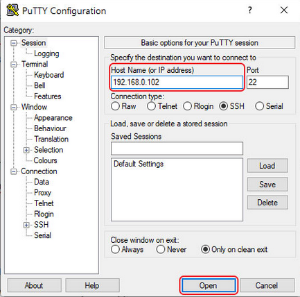
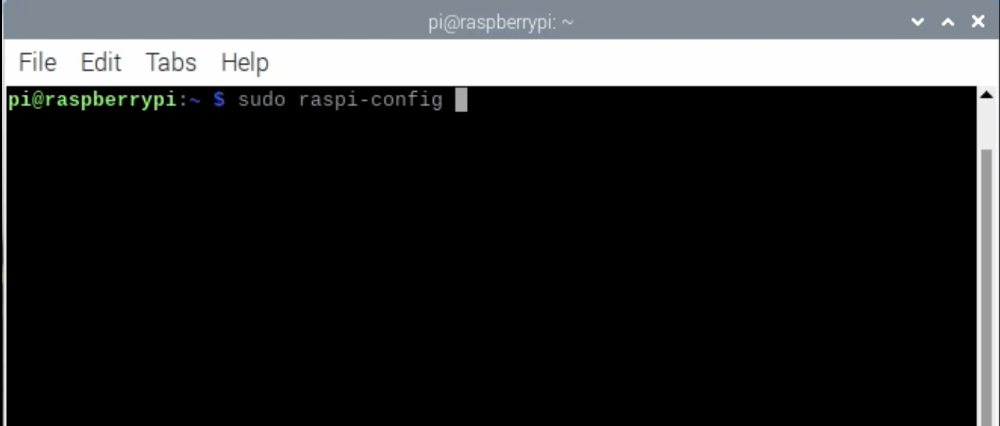
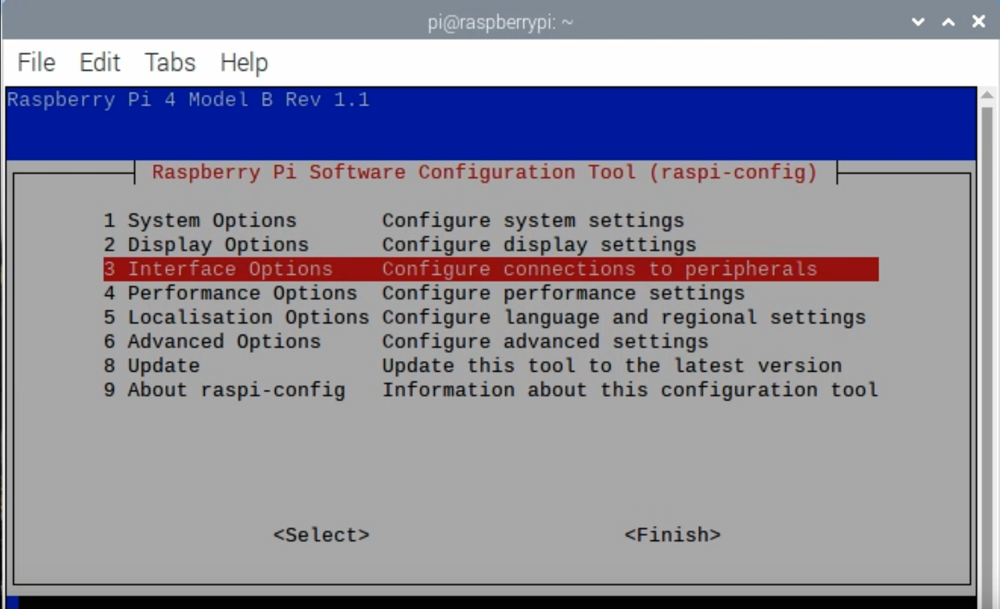
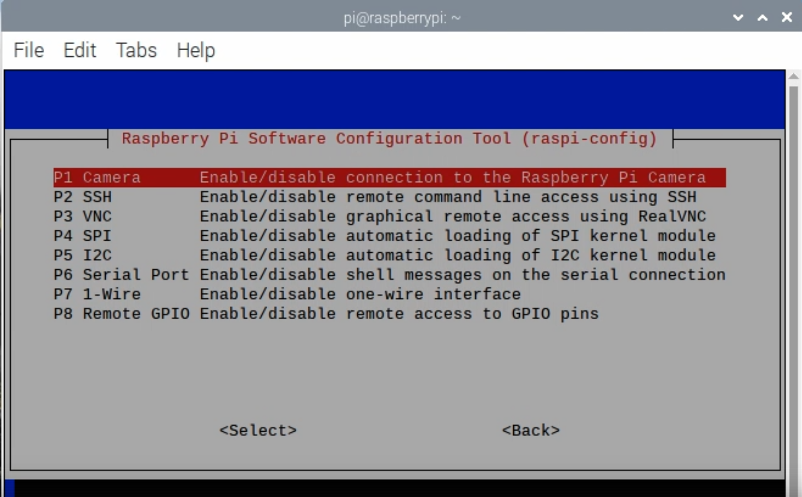
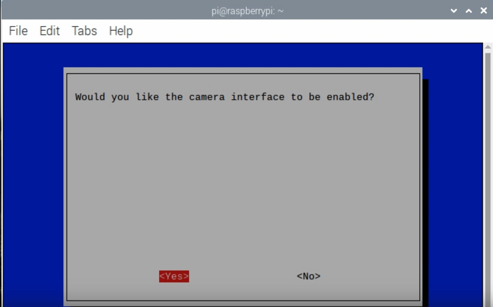

# RasPi Car
## Project start and setup
1.	Turn on raspberry pi
2.	Connect it to a monitor and keyboard. (In our case, we will connect it via HDMI to a laptop)
3.	Now you need to connect to the raspberry pi via ssh:
		1)Connect Ethernet cable   
		2)With the help of the IP-scanner we find out IP rasberry pi   
		3)Using the command: ```ssh pi@<IP>```   
		4)If the connection failed, then use this program PuTTY https://www.putty.org   
		   
		5)Enter login: pi and password: raspberry    
4.	Enter the following commands:
	```console
	pi@raspberrypi:~$ sudo apt-get update 
	pi@raspberrypi:~$ sudo apt-get upgrade
	```
5.	Allow the use of the camera:
	   
	   
	   
	   
6.	Download required VNC Viewer  https://www.realvnc.com/en/connect/download/viewer/
7.	Let's enter the command: vncserver
8.	Run VNC Viewer and enter the IP you received in 3)  <ip>:1
9.  	Once connected, open a terminal and enter the following:
	
  ```console
  pi@raspberrypi:~$ git clone https://github.com/polySladkiy/raspi_car.git
  pi@raspberrypi:~$ cd ./raspi_car/Finish
  pi@raspberrypi:~/raspi_car/Finish $ python3 real_time_object_detection.py --prototxt MobileNetSSD_deploy.prototxt.txt --model MobileNetSSD_deploy.caffemodel -u MOVIDIUS
  ```
